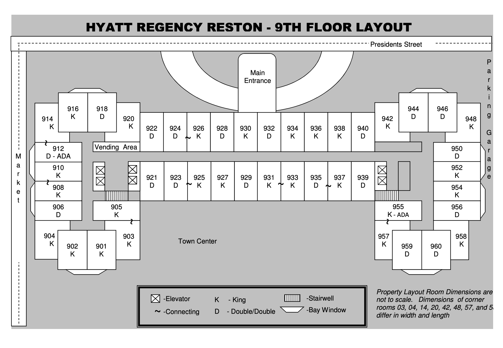
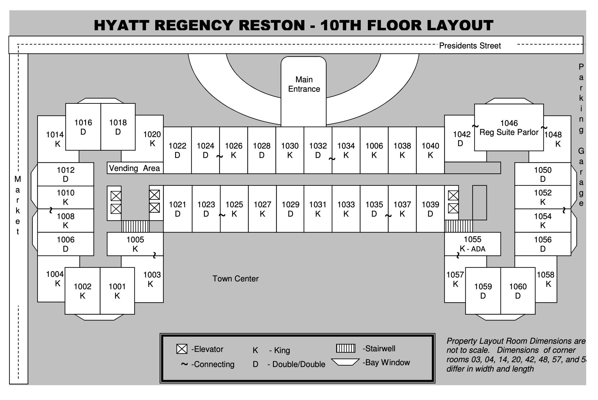
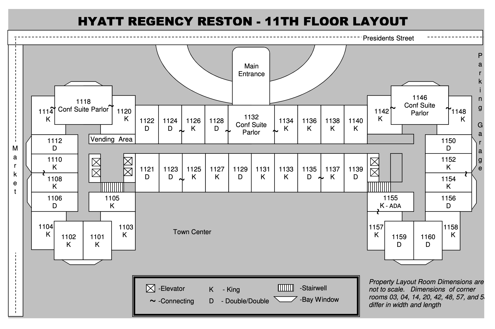

# Table of Contents
{: .no_toc}
* A markdown unordered list which will be replaced with the ToC, excluding the "Contents header" from above
{:toc}

# Getting to NSC

The 2019 NSC will be held at the [Hyatt Regency Reston](https://goo.gl/maps/tAp4NSVPqVH2) in Reston, VA. You can reach the hotel via a hotel shuttle from Dulles Airport (IAD), the Silver Line Metro to WMATA Bus, and/or Uber/Lyft/cab.

If you are traveling by bus or rail to Washington, DC, we recommend traveling to Dulles after arriving in DC and taking the hotel shuttle from there. Various ways to travel between downtown DC and Dulles are outlined [here](https://freetoursbyfoot.com/transportation-washington-d-c-dulles-airport/).

## Hotel Shuttle Information

The Hyatt Regency Reston offers a complimentary shuttle to and from Dulles Airport. Shuttle service is based upon request, by simply texting the keyword “SHUTTLE” to *703-991-2117* when you arrive at the airport. The requested pick up times will be at the top of each hour between 6:00 a.m. to 10:00 p.m. Monday - Friday and 7:00 a.m. to 10:00 p.m. on Saturday - Sunday. Requests for pickip should be received at least 15 minutes prior to the top of hour. The pick-up and drop-off point will be at curbs 2A and 2H, adjacent to the lower level baggage claim level.

# Hotel Map

## Second Floor

## Ninth Floor

## Tenth Floor

## Eleventh Floor

# Restaurant Guide  

Coming soon!