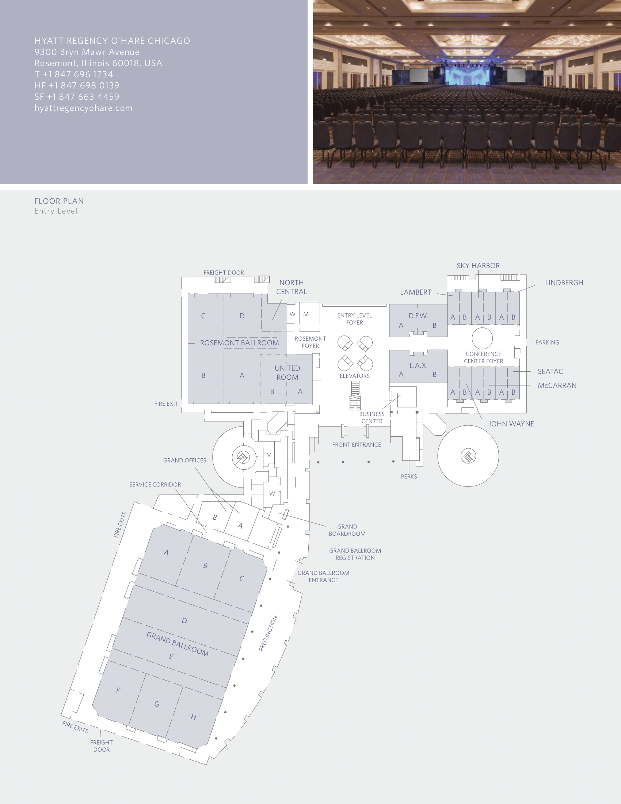
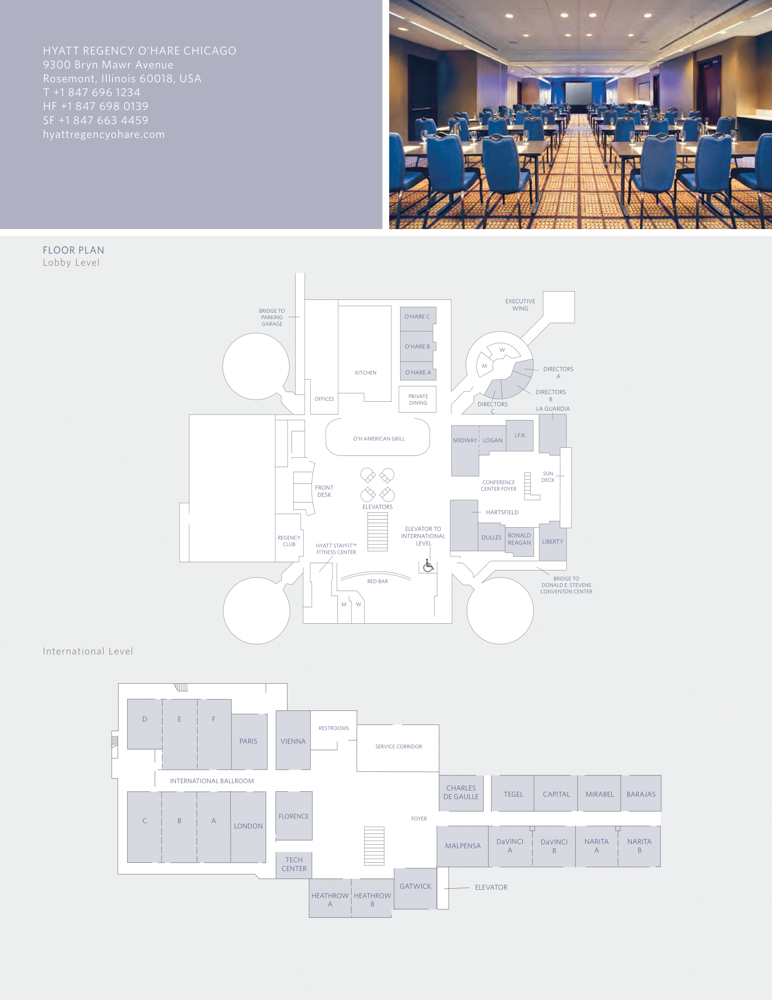

# Table of Contents
{: .no_toc}
* A markdown unordered list which will be replaced with the ToC, excluding the "Contents header" from above
{:toc}

# Getting to NSC

The 2022 NSC will be held at the [Hyatt Regency O'Hare](https://www.hyatt.com/en-US/hotel/illinois/hyatt-regency-ohare/chiro) at [9300 Bryn Mawr Ave, Rosemont, IL 60018](https://maps.google.com/maps?q=Hyatt+Regency+O%27Hare&ll=41.985589,-87.868738&spn=0.047211,0.069437&oe=utf-8&client=firefox&fb=1&gl=us&hq=hyatt+regency+o%27hare&cid=3544474959961181820&t=h&z=14). You can reach the hotel via a hotel shuttle from O'Hare, using the Blue Line, or via car. The hotel shuttle leaves the airport every 15 minutes from Door #1 of the Bus and Shuttle Center. Double-check that you’re taking the shuttle to the Hyatt Regency O’Hare, not the Hyatt Rosemont.

# Hotel Map

## Entry Level

## Lobby and International Levels

Rooms 2140-2640 are found in the Executive Wing, which can be accessed through the Lobby Level.

# Restaurant Guide  

Coming soon!
