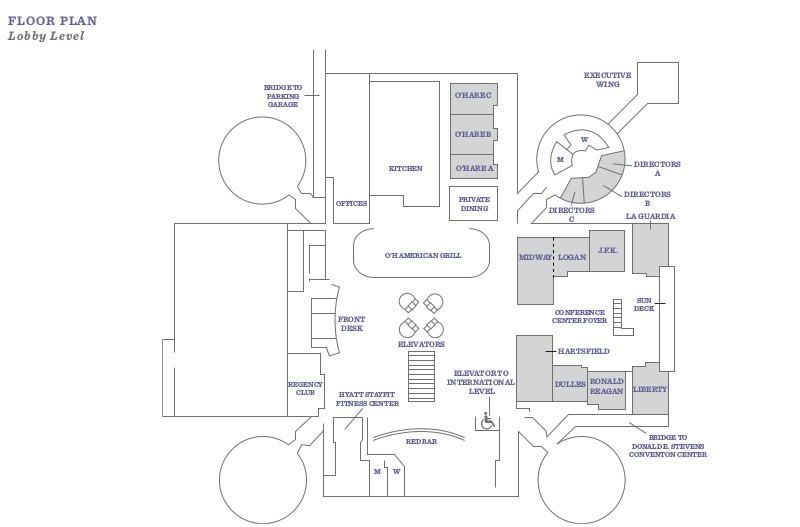
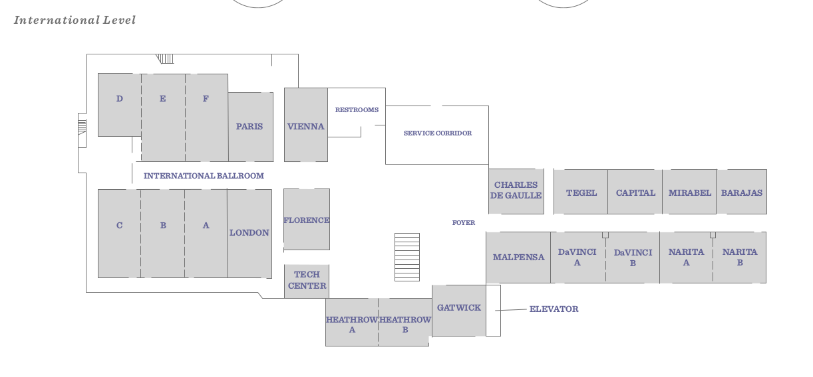

## Entry Level

## Lobby Level

## International Level

## Restaurant Guide  

<iframe src="https://www.google.com/maps/d/u/0/embed?mid=1WuicfK0KnKHGCNV6T7_yI1Ns-FY" width="640" height="480"></iframe>
  
The food court in the walkably close Fashion Outlets (5220 Fashion Outlets Way, ~20 minutes/1
mile) offers a number of dining options that are ideal for the NSC lunch schedule:  

- DJ's Taco Bar
- Little Tokyo
- Sbarro
- Freshii
- Maoz Vegetarian
- China Mix
- South Philly Steak & Fries
- Chicken Now
- Chicago Burger Company

The map above highlights some of the nearby sitdown restaurants- we recommend against visiting such sit-down restaurants for Saturday lunch in the interest of time.
