---        
title: 2017 NSC Team Directory
---

* TOC
{:toc}

## California

### Amador Valley High School     
**Coach**: Hai Lin, Ning Zhang      
**Roster**:      
Kevin Zhu (Junior)     
Shaunak Mitra (Freshman)     
Matthew Lin (Junior)
 
  

**Team Notes:**     
Our school Amador Valley high school has been to NSC PACE in previous years; however, as many of our players graduate, this is the first year we are going to PACE with this roster.Some of our accomplishments we have had this year include: 12th place at California Cup #1, 9th place at 2016 Cal Classic, 5th place at the ACF Fall High School Mirror in Valley Christen, 11th place at California Cup #3, and 7th place at Evergreen Valley Pre-Nationals Tournament. This year we are also participating in the HSNCT tournament held in Atlanta.

---
### Canyon Crest A
**Roster**:      
Daniel Wang (Junior)     
Boopala Arul (Junior)     
Claire Lee (Junior)     
Jeffrey Qiu (Junior)
  

**Team Notes:**     
Last year, CCA got 6th place at PACE NSC. They return three members of that team and hope to perform well again this year. 

---
### Canyon Crest B
**Roster**:      
Alan Zhu (Sophomore)     
George Cheng (Junior)     
Wesley Zhang (Freshman)     
Shreyank Kadadi (Freshman)     
Raymond Song (Freshman) 

---
### Cathedral Catholic A     
**Coach**: Dan Dahms      
**Roster**:      
Keoni Rodriguez (Senior, headed to Stanford)     
Noah Crousore (Senior, headed to UCLA)     
Bradley Sweeney (Senior, headed to Tulane)     
Jorge Martin (Junior)     
Dominic Sprigg (Sophomore)     
Paulina Nguyen (Sophomore)

---
### Cupertino High School     
**Coach**: Peter Ciotta, Krishnakumar Sriramadhesikan      
**Roster**:      
Emma Shearin (Senior, headed to UC Berkeley)     
Srikar Boinapally (Senior, headed to UC Berkeley)     
Atul Ragunathan (Junior)     
Archishman Sravankumar (Junior)     
Anirudh Krishnakumar (Sophomore) 

---
### Davis     
**Coach**: Janet Kean      
**Roster**:      
Ethan Skinner (Junior)     
Ben Skinner (Freshman)     
Collin Fitzpatrick (Freshman)     
James Snell (Junior)
  

**Team Notes:**     
For the second year in a row, the Davis High School Quiz Bowl Team has won both the Varsity and Junior-Varsity divisions of the prestigious and world renowned California Cup Series. A great academic institution, our team features such star players as Ethan PPG Monstrosity Skinner, Collin Science God Fitzpatrick, Ben Warrior of Harambe Skinner, and James Actually took APUSH Snell. Our team has historically broken the legendary Hoppes-Mikanowski Limit a record four times! Other skills of our team include competitive poutine eating, with Ethan's personal best at 14 pounds in ten minutes.

---
### Homestead A     
**Coach**: Jason Scott      
**Roster**:      
William Scott (Senior, headed to Tufts University)     
Brandon Herren (Senior, headed to Georgetown)     
Alistair Gray (Junior)     
Wade Wong (Junior)     
Meera Srinivasan (Sophomore) 

---
### La Jolla      
**Coach**: Aaron Quesnell      
**Roster**:      
James Malouf (Senior, headed to UC Berkley)     
Shane Pauker (Senior, headed to UC Berkley)     
Sam Kaseff (Sophomore)     
Jennifer Andrey (Sophomore)
  

---
### Pi-oneers 
**Roster**:      
Josh Rollin (Freshman)
 
 
 
  

---
### Rancho Bernardo       
**Coach**: Emily Novet       
**Roster**:      
Bryan Ugaz (Senior, headed to Arizona State University )     
Omar El-Sabrout  (Senior, headed to Stanford )     
Aaron Applegate (Junior, headed to UCSD)     
Claire Ahn  (Sophomore)
  

---
### Westview
**Roster**:      
Rahul Keyal (Senior, headed to UC Berkeley)     
Chaitanya Kore (Senior, headed to UC Irvine)     
Shivank Nayak (Senior, headed to Cornell)     
Kevin Yu (Junior)
  

**Team Notes:**     
Following an extremely successful 2016-2017 season, the Westview Quizbowl team is excited to compete at the national level at the 2017 PACE NSC. Their second year as a team together, the four core members have had ample time to develop chemistry with one another and find each of their niches of academic study. Heading into the nationals season, they're undeniably the top team of Southern California, having only placed outside first at a single tournament when fielding a full team. They're both excited and anxious to make waves at the national level, having not gotten the opportunity to compete against other top high schools due to the geographic isolation of the SoCal circuit. But most importantly, the team, fielding 3 seniors who have competed with one another since 8th grade, hopes to finish off their career on a high note.

---
---

## Connecticut

### Mather High
**Roster**:      
Michael Borecki (Senior, headed to Bowdoin College)     
Julia Tong (Junior)
 
 
  

---
----

## Delaware

### Wilmington Charter (JV)     
**Coach**: Mrs. Rosemary Basquill      
**Roster**:      
Sohum Shenoy (Sophomore)     
Anthony Lee (Freshman)     
Raghav Garg (Freshman)     
Aman Singh (Freshman)
  

---
---

## Georgia

### Chattahoochee A     
**Coach**: Michael Mathis      
**Roster**:      
Tej Guttikonda (Senior, headed to University of Pennsylvania)     
Ashwin Ramaswami (Senior, headed to Stanford)     
Aditi Choudhury  (Senior, headed to Georgia Tech)     
Abhinav Kumar (Senior, headed to Georgia Tech)     
Kevin Huang (Junior) 

---
### Chattahoochee B     
**Coach**: Michael Mathis      
**Roster**:      
Niranjan Ramasekaran (Junior)     
Soham Kulkarni  (Junior)     
Andy Luo (Sophomore)     
Harrison Zhu (Sophomore)
  

---
### Collins Hill High School     
**Coach**: Scott Kim and Andy Merrick      
**Roster**:      
Min Kim (Senior, headed to University of Florida)     
Chris Saroza (Senior, headed to University of Chicago)     
Indy Schieber (Senior, headed to University of Georgia)     
Daniel Nguyen (Senior, headed to University of Georgia)     
Rubin Park (Junior)     
Connor Maguire (Sophomore)

**Team Notes:**     
The Collins Hill Academic Team has had their most successful season to date, winning the GATA Varsity Division 1 State Championship and Jag Bowl XI. We have also finished in the top 3 at Bulldog Brawl, BISB, ATTACK and Marist WIT. We are excited to attend our first PACE NSC and will be looking to send our head **Coach**, Scott Kim, off to North Gwinnett Middle School on a high note. Assistant **Coach** Andy Merrick will be taking over as head **Coach** of the team in 2017-18.

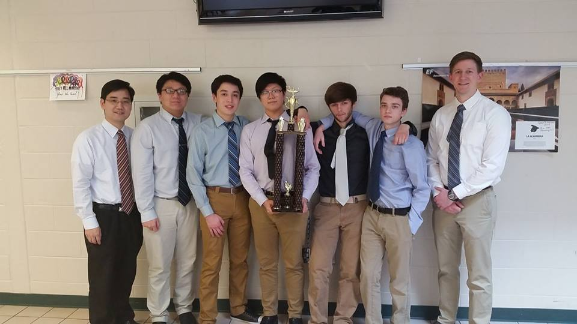

---
### Johns Creek     
**Coach**: Santhi Prabahar      
**Roster**:      
Andrew Liang (Senior, headed to Harvard)     
Grace Rarer (Junior)     
Mahant Malempati (Junior)     
Sarah McWhirter (Sophomore)     
Neha Subramanian (Sophomore)     
Heng Qi (Freshman)

**Team Notes:**     
The Johns Creek Quiz Bowl team is proud to participate in its 3rd PACE NSC, after finishing 24th at the 2016 NSC. In the 2016-2017 season, it took 1st place at both the GATA 2A Varsity State Tournament and the GATA Fall Tournament, which it has won for three consecutive years. Johns Creek also placed 34th at the 2016 HSNCT.       
The PACE team consists of Grace Rarer, Andrew Liang, Mahant Malempati, Sarah McWhirter, Neha Subramaniyan, and Heng Qi. Captain Andrew Liang will also be a member of the 2017 NASAT team from Georgia, after helping Georgia garner 4th place at the 2016 NASAT. Johns Creek is **Coach**ed by Mrs. Santhi Prabahar, who has led the team to all 6 national tournaments in its history, and the school recently hosted its third annual NAQT middle school tournament, with 30 teams in attendance

---
### Marist School     
**Coach**: Rand Wise, Julie Anderson      
**Roster**:      
Christina Shin (Senior, headed to Duke University)     
Ally Denton (Junior)     
Ben Wise (Junior)
 
  

**Team Notes:**     
Marist finished second in Georgia in our size class this year.  This is our third year competing at PACE-NSC, and we are glad to be back.  Marist is a perennial top ten team in Georgia.  

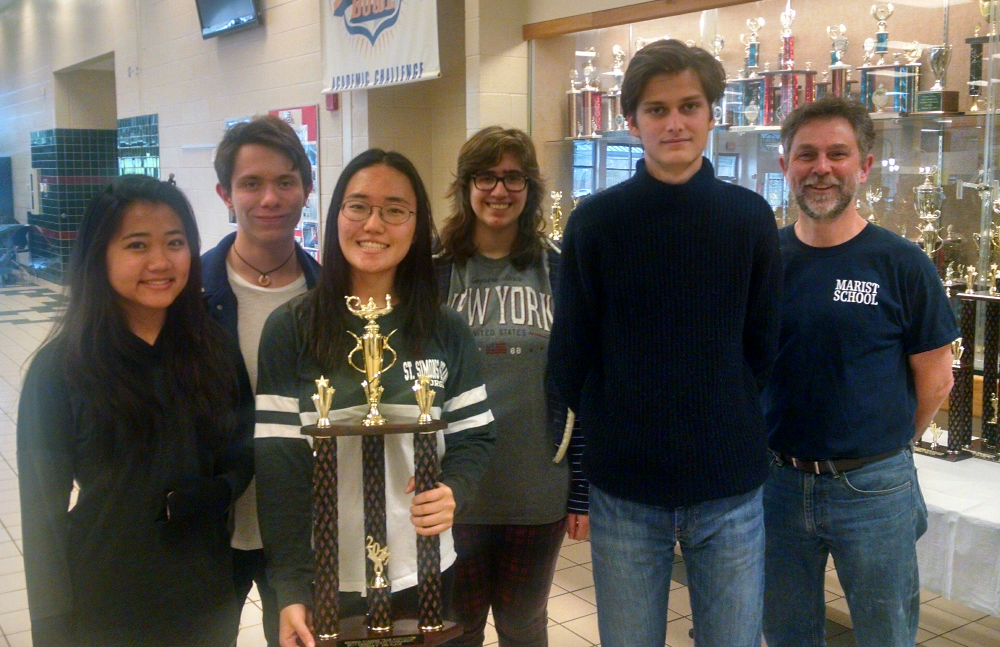

---
### Northview High School (JV)    
**Coach**: Scott Fowler      
**Roster**:      
Amshu Chakragiri (Sophomore)     
Akaash Para (Sophomore)     
Ayush Nene (Sophomore)     
Varun Vangala (Sophomore)     
Evan Ouyang (Sophomore) 

**Team Notes:**     
NHS recently finished second on WSB-TV's HighQ state-wide competition, earning $3000 in scholarship money. In middle school, this group of sophomores ranked 5th and 3rd in consecutive years.

---
---

## Illinois

### Adlai E. Stevenson A
Coach: Ryan Fedewa
**Roster**: 
Ali Saeed (Senior, headed to Stanford)
Young Lee (Senior)
Deepak Moparthi (Junior)
Govind Prabhakar (Freshman)
  
---

### Adlai E. Stevenson B
Coach: Ryan Fedewa
**Roster**: 
Shamsheer Rana (Junior)
Conrad Oberhaus (Junior)
Healey Kogan (Freshman)
David Holmquist (Freshman)
Ani Nuthalapati (Sophomore) 

---

### Barrington High School     
**Coach**: William Rohner      
**Roster**:      
Matthew Lehmann (Senior, headed to University of Chicago)     
John Waldron (Senior, headed to University of Minnesota)     
Wilder Seitz (Junior)     
Kyle Asta (Junior)     
Abraham Holtermann (Freshman) 

---
### Carbondale     
**Coach**: Sharon Robinson Lorinskas      
**Roster**:      
Ananth Panchamukhi (Senior, headed to University of Chicago)     
Michael Muzinich (Senior, headed to University of Oklahoma)     
Jaden Lucas (Junior)     
Benjamin Tolley (Junior)     
Shaunie Talapatra (Sophomore) 

**Team Notes:**     
Carbondale won the Southern Illinois Academic Conference Championship, the IHSA Regional and Sectional Championship, the Masonic Academic Bowl Sectional  Championship, placed 4th the UIUC Early Bird and 3rd at Ladue, Missouri's LIST Tournament.

---
### Carl Sandburg High School     
**Coach**: Mike Woolley, Jeff Brigham, David Brewczynski      
**Roster**:      
Claudia Danowski (Junior)     
Angela Vainikos (Sophomore)     
Aristotle Vainikos (Sophomore)     
Sofia Vainikos (Sophomore)     
Ben Walter (Sophomore) 

---
### Homewood-Flossmoor Community High School     
**Coach**: Head **Coach** Michael Sacks, Assistant **Coach** Michael Camp      
**Roster**:      
Lily Hamer (Senior, headed to Washington (St. Louis))     
Declan Cawley (Junior)     
Nathaniel Bouchie (Senior, headed to Florida Institute of Technology)     
Thomas Simon (Senior, headed to Northwestern University)     
Michael Bonthron (Senior, headed to Illinois Institute of Technology)     
Ethan Bosch (Junior)

**Team Notes:**     
2nd place out of 60 at Kickoff Tournament in November, SWSC Conference Tournament Champions, 4 members of team All-Conference (Lily Hamer, Declan Cawley, Nathaniel Bouchie, Thomas Simon), 2 members of team All-Sectionals (Lily Hamer, Declan Cawley), 1 member of team All-State (Lily Hamer).

---
### IMSA A     
**Coach**: Mike Kolton, Dennis Loo      
**Roster**:      
Pranav Sivakumar (Senior, headed to University of California-Berkley)     
Nathaniel Smith (Senior, headed to California Institute of Technology)     
Alex Orlov (Senior, headed to University of Minnesota-Twin Cities)     
Rebecca Mathew (Junior)     
Shivani Sharma (Junior)     
Hanson Hao (Sophomore)

**Team Notes:**     
IMSA had a strong year again this year. The Titans won the IHSA Class AA state tournament and placed 3rd in Masonic Tournament. IMSA is looking forward to a great weekend of quizowl and competing against all the teams from across the country.

---
### Keith Country Day School A     
**Coach**: Matthew McGinnis, Patrick Paul Hogan      
**Roster**:      
Kristie Bodak (Senior, headed to UW Madison)     
Jacob Emrich-Muise (Junior)     
Isabella Falsetti (Junior)     
Cooper Roh (Middle School)     
Haley Shaw (Junior)     
Michael Von Driska (Junior)

**Team Notes:**     
The Keith Country Day School Upper School Academic Bowl Team has had a very successful year.  We took second place in the 1A Division of the Masonic State Competition in Illinois and we were an IHSA Regional Champion too.  We hope to continue our successful run at PACE-NSC.  Although we are a small team, we train hard and we hope to recruit more members from our school’s highly success Middle School Academic Bowl Team for next year!

---
### Lempa     
**Coach**: Anishka Bandara (student **Coach**)      
**Roster**:      
Anishka Bandara (Senior, headed to UCLA)     
Kevin Kodama (Sophomore)     
Sanjeev Venkatesan (Senior, headed to University of Illinois at Urbana-Champaign)     
Cole Tamondong (Senior, headed to Indiana University)     
Jonathan Panton (Senior, headed to Illinois Wesleyan)     
Warren Scales-Burgos (Senior, headed to Purdue)

**Team Notes:**     
We are Oak Park-River Forest High School's quizbowl team. Since our school year will be over, we will be competing as Lempa. This past year, our team placed 3rd at IHSSBCA kickoff at Fenwick, 3rd at Loyola Ultima, 3rd at ATROPHY, and won the local Western Suburban Conference championship. 

---
### Loyola Academy     
**Coach**: Denise Kreb, Jamie Simon      
**Roster**:      
Michael Finnegan (Senior, headed to Boston College)     
Jack Mayer (Senior, headed to Loyola University Chicago )     
Patryk Kolodziej  (Junior)     
Sean Sumugat  (Sophomore)     
Jack Nugent (Freshman) 

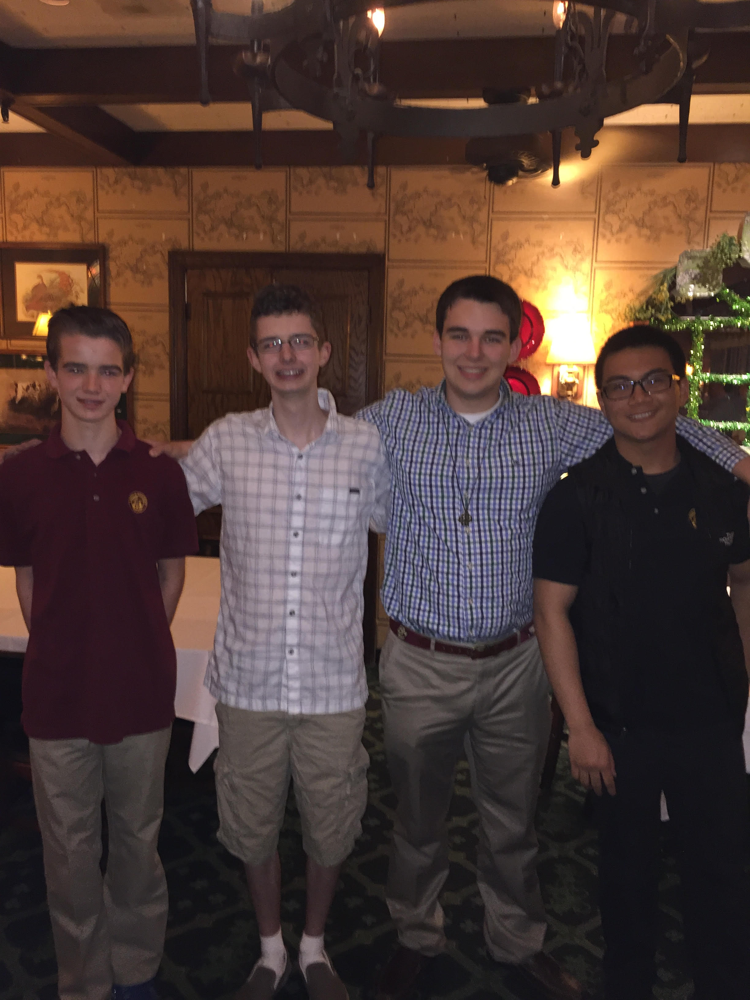

---
### Metea Valley     
**Coach**: Wes Brzykcy, John Riddle      
**Roster**:      
Arpan Laha (Senior, headed to University of Illinois)     
Kieran Kaempen (Senior, headed to University of Illinois)     
Nick Kaminsky (Junior)     
Arjun Sundararajan (Junior)     
Ishan Shah (Junior) 

**Team Notes:**     
Metea Valley is a competitive and relatively new school in the suburb of Chicago. We are proud to have won 6 regional championships in the last 7 years. We look forward to meeting with so many teams from all over the country!

---
### Naperville North     
**Coach**: Yvonne John      
**Roster**:      
Jakob Myers (Senior, headed to Michigan State)     
Shawn Yoshida (Senior, headed to Case Western)     
Kelvin Li (Senior)     
Jason Hu (Junior)     
Jacob Fisher (Junior)     
Emily Hou (Junior)

---
### Rockford Auburn     
**Coach**: Linda J. Greene      
**Roster**:      
Ethan Strombeck (Sophomore)     
Lilly Chavez (Sophomore)     
Leif Verace (Sophomore)     
Zane Clevenger (Junior)     
Morad Suliman (Junior) 

**Team Notes:**     
Season highlights for our team so far include, at the local level, repeating as conference champions and winning the TV show Stateline Quiz Bowl for the third year in a row.  At state competitions, we came in third at the IHSA class AA Scholastic Bowl tournament and fourth at the Illinois NAQT State tournament.     
We look forward to playing teams from all over the country at this year's NSC.

---
### Urbana University Lab School Snake Farm     
**Coach**: Chris Butler      
**Roster**:      
Andrew Steltzer (Senior)     
Reed Phillips (Junior)     
Robert Nagel (Sophomore)     
Tim Cho (Sophomore)     
Matthew Tang (Freshman)     
Dylan Bowman (Freshman)

---
### Waubonsie Valley
**Roster**:      
Brian Kalathiveetil (Senior, headed to University of Minnesota)     
Addison Hagerman (Senior, headed to Iowa State University)     
Sidarth Rajan      
Andrew Du (Freshman)
  

**Team Notes:**     
IHSA Regional Champions; record of 52-25

---
---

## Indiana

### Saint Joseph     
**Coach**: Ben Dillon      
**Roster**:      
Reed Oei (Senior)     
Gus Desch (Senior)     
Will Spretnjak (Senior)     
Tomás Aguilar-Fraga (Sophomore)
  

**Team Notes:**     
Saint Joe has won the Indiana Rotary State Championship for five consecutive years.

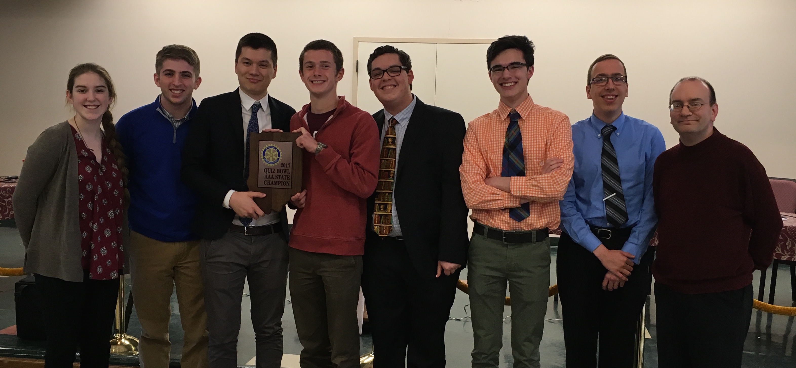

---
### Wm. H. Harrison High School     
**Coach**: Lynette Schneider      
**Roster**:      
Agustin Garcia (Senior, headed to MIT)     
Ben Anthony (Senior, headed to Purdue)     
Thomas Kennell (Senior, headed to Purdue)     
Jon Hillary (Junior)     
Jacob Schwartz (Junior) 

---
---

## Kentucky

### Danville High School (SS)     
**Coach**: Rob Kremer      
**Roster**:      
Daniel McAllister (Senior, headed to Centre College)     
Sarah Goosey (Senior, headed to Transylvania University)     
Anas Gondal (Sophomore)     
Eli Gooch (Sophomore)
  

---
### Glasgow High School (SS)     
**Coach**: Todd Garrison      
**Roster**:      
Anish Patel (Senior, headed to University of Kentucky)     
Rajeev Nair (Junior)     
Garrison Page (Junior)     
Mason Reid (Sophomore)
  

**Team Notes:**     
Six tournament wins this year including 2017 SSNCT Traditional Public Division.

---
### Paul Laurence Dunbar A     
**Coach**: Ben Crawford, Susan Magedanz      
**Roster**:      
David Ma (Junior)     
Hannah Wang (Junior)     
Ananth Miller-Murthy (Senior, headed to Yale University)     
Zsombor Gal (Junior)
  

---
### Paul Laurence Dunbar B (JV)     
**Coach**: Susan Magedanz, Ben Crawford      
**Roster**:      
Angus Maske (Sophomore)     
Shashank Bhatt (Sophomore)     
Aneesh Kadambi (Freshman)     
David Vulakh (Freshman)
  

---
### Simon Kenton     
**Coach**: Chris Girard      
**Roster**:      
Emily Girard (Sophomore)     
Nicholas Griffey (Junior)     
Sam Roberts (Senior)     
Chelsea Russell (Senior)
  

---
### Woodford     
**Coach**: April York, asst: Ken Tonks & Devan Martinez      
**Roster**:      
Seth Allen (Junior)     
Sarah Potts (Junior)     
Wesley Forte (Junior)     
Ryan Mink (Senior, headed to University of Kentucky)     
Connor Akers (Sophomore) 

---
---

## Massachusetts

### Phillips Academy
**Roster**:      
Sam He (Senior, headed to UC Berkeley)     
Brandon Qi (Junior)     
Carson Teitler (Junior)     
Eric Yo (Junior)
  

---
---

## Maryland

### Richard Montgomery High School     
**Coach**: Dr. Wendy Sparks      
**Roster**:      
Alex Hu (Junior)     
Adam Howlett (Junior)     
Naveen Raman (Junior)     
Kevin Lu (Sophomore)
  

---
---

## Michigan

### Detroit Catholic Central A     
**Coach**: Christopher Gismondi      
**Roster**:      
Austin Morton (Senior, headed to University of Michigan)     
Robert Mansuetti (Senior, headed to University of Michigan)     
Will Lamarra (Senior, headed to Notre Dame University)     
Robert Crawford (Junior)
  

**Team Notes:**     
The DCC A team finished the season with an overall record of 196-26, including 14 tournament championships. The team won its 7th consecutive NAQT State Championship and enters Nationals as the #1 ranked team in the country.  

---
### Detroit Catholic Central B     
**Coach**: Benjamin Herman      
**Roster**:      
Josh George (Senior, headed to Hillsdale College)     
Lance Bassett (Junior)     
Nathaniel Pascual (Junior)     
Sean Gillikin (Junior)
  

**Team Notes:**     
The DCC B team finished the season with an overall record of 107-33 and ranked #46 nationally.  

---
### Detroit Catholic Central C     
**Coach**: Anthony Cornish      
**Roster**:      
Ian Mascarenhas (Junior)     
David DeBacker (Sophomore)     
Jonah Fanning (Junior)     
Parker Stogdill (Sophomore)
  

**Team Notes:**     
The DCC C team finished the season with an overall record of 64-40 and ranked #152 nationally.  

---
### Detroit Country Day School     
**Coach**: Brad McNellen      
**Roster**:      
Krishan Amin (Senior, headed to University of Michigan)     
Christopher Gilmer-Hill (Junior)     
Rohan Gurram (Senior, headed to Yale University)     
Rohit Misra (Senior, headed to University of Michigan)     
Omer Siddiqui (Senior, headed to University of Michigan) 

**Team Notes:**     
We won the Fall Kickoff Tournament and the March Madness Tournament at Michigan State University.  We are also the Michigan Inter-County Quiz Bowl League champions and the Michigan Class B State champions.

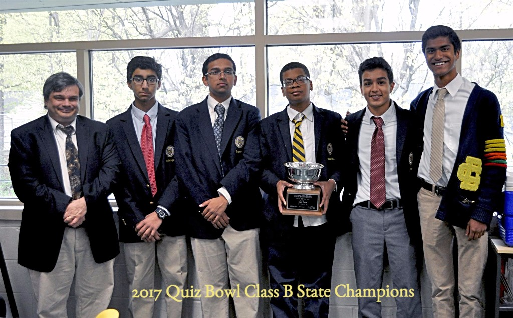

---
### Sacred Heart Academy      
**Coach**: Kathryn Hausbeck      
**Roster**:      
Devin Humphreys (Senior, headed to Michigan State University)     
Henry Armah (Junior)     
Wendy Erickson (Senior, headed to University of Michigan)     
Madelon Humphreys (Freshman)     
Lesley Armah (Freshman) 

**Team Notes:**     
Sacred Heart Academy has had an amazing year, doing well at all of its major tournaments. Earlier this year, the team won both the Mid-State Activities Conference for the eighth year in a row, as well as a second Catholic High School League championship. For the third year in a row, the team won the Quiz Central Gold Division Championship, and for the second time in three years, the team went on to be Quiz Central Grand Champions. Sacred Heart Academy qualified for the NSC through its 8th-place finish at the University of Michigan Autumn Classic, and for the first time in program history, Sacred Heart Academy won the Class C/D State Championship. Sacred Heart Academy is excited to be competing in its second NSC in two years, and hopes this year's venture is successful.

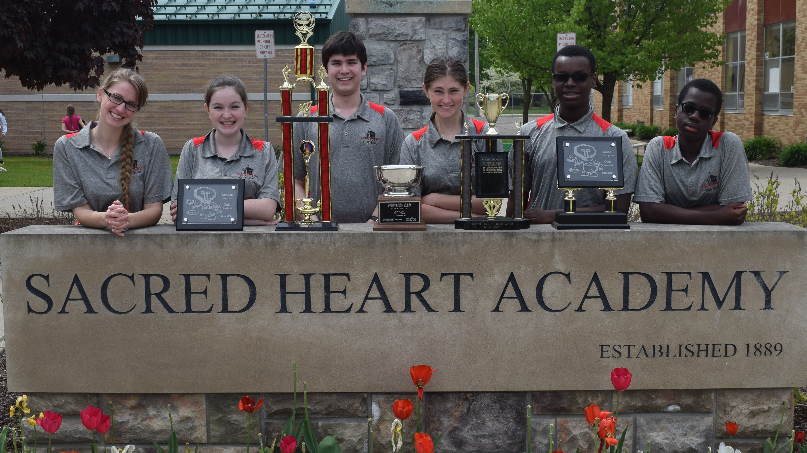

---
### Utica Academy for International Studies     
**Coach**: William Dobbie, Zachariah Crossen      
**Roster**:      
Collin Syler (Senior, headed to Michigan State University)     
Tyler Nguyen (Junior)     
Natalie Crossen (Junior)     
Erdem Ozdemir (Sophomore)     
Nick Borchich (Sophomore) 

**Team Notes:**     
The relatively young team from UAIS had another successful season earning their 5th consecutive local league championship along with a number of top tier finishes in the competitive Michigan circuit.

---
---

## Minnesota

### Wayzata     
**Coach**: Meaghan Decker,Brian Decker      
**Roster**:      
Tora Husar (Junior)     
Joe Kammann (Junior)     
Brian Lin (Freshman)     
Ashmita Sarma (Senior, headed to University of Minnesota)     
Pranav Maddula (Senior, headed to Washington University) 

---
---

## Missouri

### Hannibal     
**Coach**: Amy Sternke      
**Roster**:      
Gavin Booth (Junior)     
Donovan Mefford (Junior)     
Clayton Sims (Junior)     
Ruby Roisum (Sophomore)     
Jessica Stinson (Sophomore) 

**Team Notes:**     
Hannibal's Academic Team (Hannnibal, MO) has had a fun season. Our highlight of the year was winning the WGEM-JWCC Academic Challenge, a televised event sponsored by a local news station and college. Our players received a total of thirteen individual medals for placing in the top ten at various tournaments this season. 

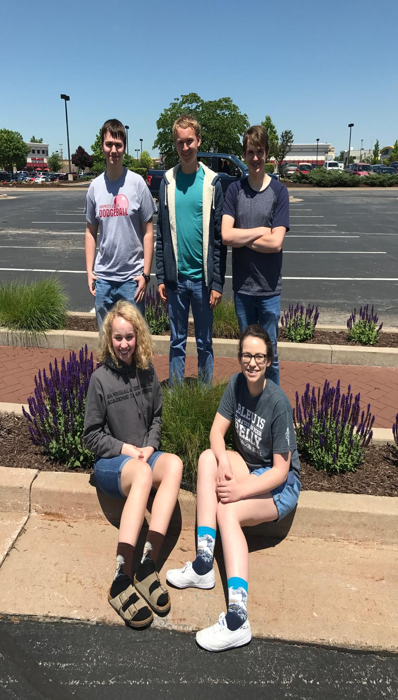

---
### Ladue Horton Watkins High School A (JV)     
**Coach**: Jonah Krueger      
**Roster**:      
Raj Paul (Sophomore)     
Akshay Govindan (Sophomore)     
Moses Schindler (Sophomore)     
Jack Madden (Sophomore)   

---
### Ladue Horton Watkins High School B
Coach: Jonah Krueger
**Roster**: 
Philip Adams (Senior, headed to University of Chicago)
Martin Oyalo (Senior, headed to University of Missouri - Columbia)
Glen Morgenstern (Junior)
William Gorski (Junior)
Charlie Loitman (Junior)

---
### Northwest High School     
**Coach**: Katie Gilbert      
**Roster**:      
Patrick Collins (Senior, headed to Missouri Institute of Science and Technology)     
Matthew Brewer (Senior, headed to University of Groningen, The Netherlands)     
Darren Schmidt (Senior, headed to Missouri University of Science and Technology)     
Joey Briggs (Senior, headed to Southeast Missouri State University)     
Tyler Warren (Senior, headed to University of Southern California)     
Noah Martin (Senior, headed to Jefferson College)

**Team Notes:**     
In its third year of existence, the Northwest High School Scholar Bowl team won Districts and Sectionals for its first time, earning the opportunity to compete in the Missouri State Tournament in Columbia and face some impressive competition.  Led by one of the team’s original founders, captain Patrick Collins, Northwest is excited for the challenge of participating in its first-ever national competition at PACE--not to mention, first-ever team road trip. 

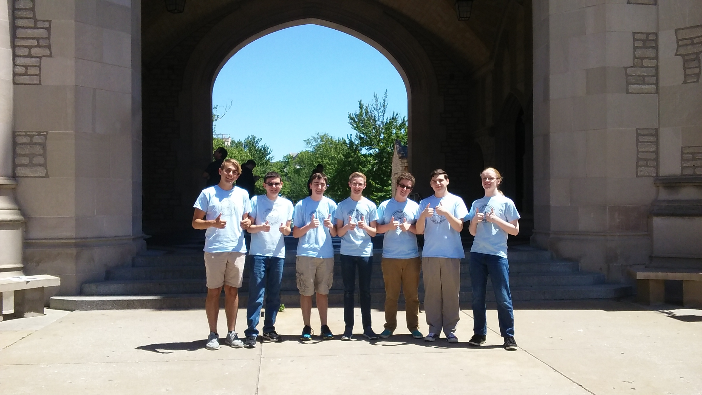

---
### Orchard Farm (SS)
**Roster**:      
Tyler Woosencraft (Senior, headed to Missouri State University)     
Will Runion (Senior, headed to University of Oklahoma)     
Brayden Diver (Senior, headed to University of Alabama)     
Taylor Payne (Junior)     
Josie Wagner (Junior) 

---
### Thomas Jefferson Independent A      
**Coach**: Justin Kleinheider       
**Roster**:      
Savannah Dillard (Freshman)     
Garrison Henkle (Senior, headed to University of Tulsa)     
Lane Wilson (Sophomore)     
Lex Baird (Senior, headed to Columbia University)     
Joey Cascone (Senior, headed to SMU)     
Jonathan Barnes (Senior, headed to Baylor University)

**Team Notes:**     
Missouri State Champions Class 1

---
### Washington A     
**Coach**: David Dennis, Jacob O'Rourke, Angel Young      
**Roster**:      
Matt Chalem (Senior, headed to Truman State)     
Matt Dew (Senior, headed to Missouri S&T (Rolla))     
Cole Phinney (Senior, headed to Missouri S&T (Rolla))     
Joe Stitz (Senior, headed to University of Missouri (Columbia))
  

**Team Notes:**     
Winners of 12 tournaments this year, including MOQBA Qualifier and MSHSAA Class 4 State Championship.  

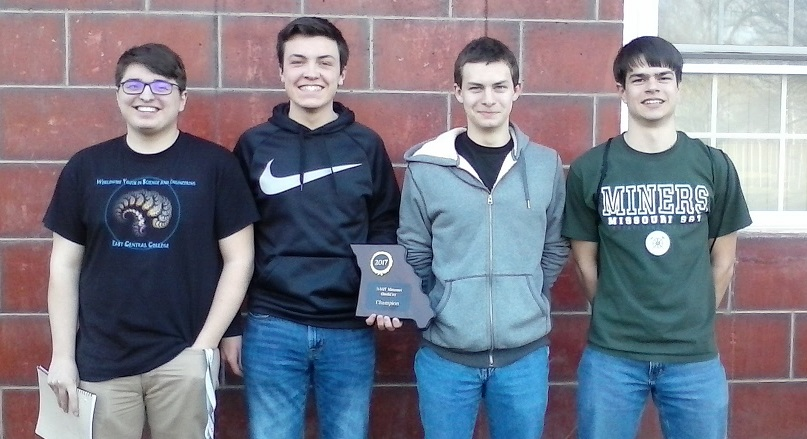

---
### Washington B     
**Coach**: David Dennis, Jacob O'Rourke, Angel Young      
**Roster**:      
Jonathan Amlong (Junior)     
James Collier (Sophomore)     
Carrie Derner (Junior)     
Spencer Johnson (Senior, headed to Truman State)
  

**Team Notes:**     
Hosted the largest tournament in MO (48 teams) on house-written WHAQ set, which has been mirrored in 17 locations across the country.  

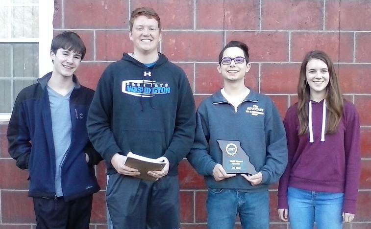

---
---

## North Carolina

### NCSSM A     
**Coach**: Geoff Coltrane, Forrest Hinton, Cynthia Buie      
**Roster**:      
Kevin Zhou (Senior, headed to University of Chicago)     
Jenna Israel (Senior, headed to Cornell University)     
Jonathan Moul (Junior)     
Stephen Schmidt (Junior)     
William Elder (Junior)     
Nolan Miranda (Senior, headed to Stanford University)

---
---

## New Jersey

### High Tech A    
**Coach**: Raymond Eng, Ph.D.      
**Roster**:      
Samuel Kao (Senior, headed to Georgetown University)     
Anjali Nambrath (Senior, headed to M.I.T.)     
Douglas Simons (Junior)     
Michael Li (Sophomore)
  

**Team Notes:**     
Princeton PHSAT XXIV, 2nd place;     
Columbia University Cup Series, 2nd place Fall, Winter, Spring;     
North Jersey History Bowl, 1st place;     
Kellenberg's LIFT XVI, 2nd place;     
NJ History Bowl, 2nd place;     
Scarlet Knight Winter Invitational Tournament, 2nd place;     
East Brunswick Funfest Tournament, 1st place;     
Mid-Atlantic History Bowl, 1st place;     
Hunter's Prison Bowl, 1st place.

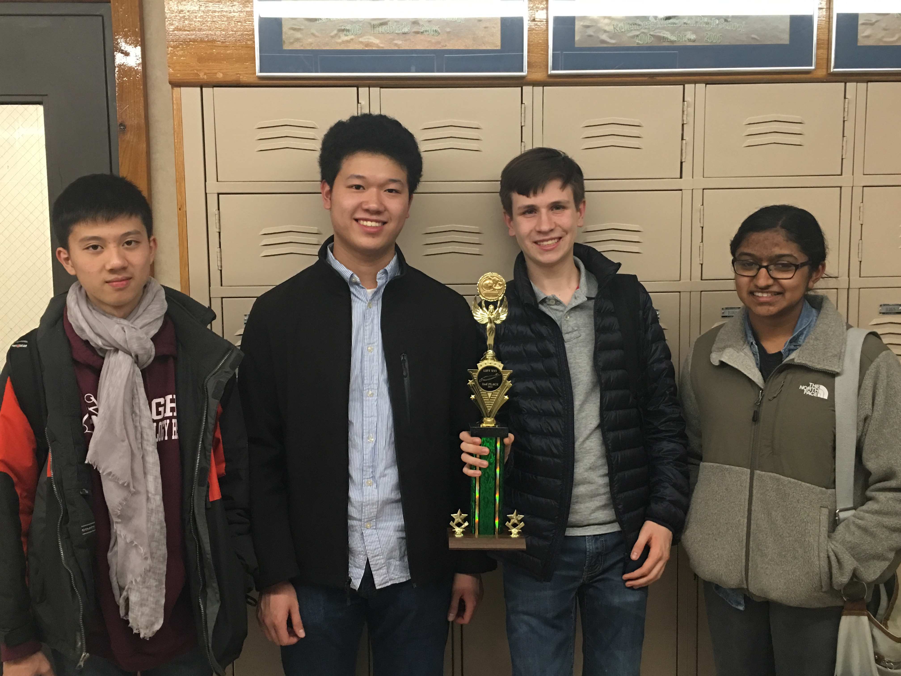

---
### High Tech B (JV)     
**Coach**: Raymond Eng, Ph.D.      
**Roster**:      
Adrian Thamburaj (Sophomore)     
Steven Liu (Sophomore)     
Darren Petrosino (Sophomore)     
Ivy Wang (Sophomore)     
Eric Zheng (Sophomore) 

**Team Notes:**     
Princeton PHSAT XXIV, 1st place, standard division;     
Columbia University Cup Series, 1st place, standard division, Fall and Winter tournaments;     
NJ History Bowl, 4th place.

---
### Middlesex County Academy     
**Coach**: Mr. Amro Mosaad      
**Roster**:      
Anthony Wang (Senior, headed to Northwestern University)     
Ayush Parikh (Senior, headed to University of Pennsylvania)     
Pratik Mishra (Senior, headed to Rutgers University)     
Abhinav Singh (Senior, headed to University of Illinois at Urbana-Champaign)     
Nirmal Prakash (Senior, headed to University of Illinois at Urbana-Champaign)     
Vraj Patel (Senior, headed to RPI/AMC 7 Year Med)

**Team Notes:**     
MCA quiz bowl has grown since its conception four years ago as the core A team has played together throughout. This season's highlights include 3 fifth place finishes at Columbia Fall, Scarlet Knight Fall, and LIFT at Kellenberg, qualifying for both PACE and HSNCT in the process. Additional top finishes include 2nd in the Standard Division at Princeton and 3rd at Scarlet Knight Spring. 

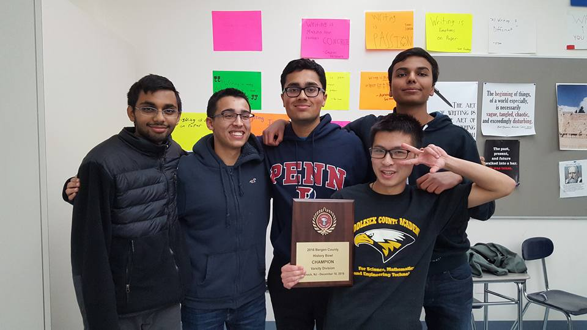

---
### Mountain Lakes High School (SS)     
**Coach**: Anne Mucci, Mark Hoffman      
**Roster**:      
Ron Mucci (Senior, headed to Rutgers University)     
Jared Goldfischer (Senior, headed to Columbia University)     
Anita Shanker (Sophomore)     
Lucy Horowitz (Freshman)
  

**Team Notes:**     
Mountain Lakes High School is a top ranked comprehensive New Jersey public high school and a small school powerhouse.  The quizbowl team maintains a highly competitive regular season schedule.  This is team captain and senior, Ron Mucci’s 4th appearance at PACE. Other team members competing are senior Jared Goldfischer, Columbia University 2021, sophomore, Anita Shanker, geography expert and freshman science phenom Lucy Horowitz.  

---
---

## Nevada

### Ed W Clark high school (JV)     
**Coach**: Manodnya Vakil      
**Roster**:      
Eshaan Vakil (Freshman)
 
 
 
  

**Team Notes:**     
Clark was season champion for the 2016-2017 Las Vegas Quiz Bowl Alliance league and NV State Champion 2016-2017. Captain Eshaan Vakil is a freshman and has been recognized by NAQT as National player of the week in Spring 2017.

---
----

## New York  

### Hunter College High School A     
**Coach**: Christopher Chilton      
**Roster**:      
Luke Tierney (Senior, headed to University of Chicago)     
Chloe Levine (Junior)     
Abishrant Panday (Junior)     
Sam Brochin (Junior)
  

**Team Notes:**     
Hunter's A team took home victories at Princeton and Columbia this year and capped off a fantastic year with their second consecutive NAQT HSNCT title!

---
### Hunter College High School B     
**Coach**: Christopher Chilton      
**Roster**:      
Daniel Ma (Sophomore)     
Gilad Avrahami (Junior)     
Ada-Marie Gutierrez (Junior)     
Rachel Yang (Middle School)     
Jeremy Kim (Freshman) 

**Team Notes:**     
Hunter B had a top 10% finish at NAQT HSNCT this year to close out an excellent year of development led by top scorer Daniel Ma.  The future of Hunter's B team is bright!

---
### Ithaca A     
**Coach**: Benjamin Kirk      
**Roster**:      
Casey Wetherbee (Senior, headed to Georgetown)     
Luc Wetherbee (Senior, headed to Cornell University)     
Daniel Xu (Senior, headed to Cornell University)     
Andrey Shakhzadyan (Senior)
  

**Team Notes:**     
Tournament wins at ACF Fall (Yale), Scarlet Knight Winter (Rutgers), BHSAT (Yale), BASQT (Bergen Academy), BrainBusters Fall (Ithaca); Top 3 ranking at PHSAT (Princeton), QuBIT (High Tech HS), Columbia Spring, EMT (Rutgers)

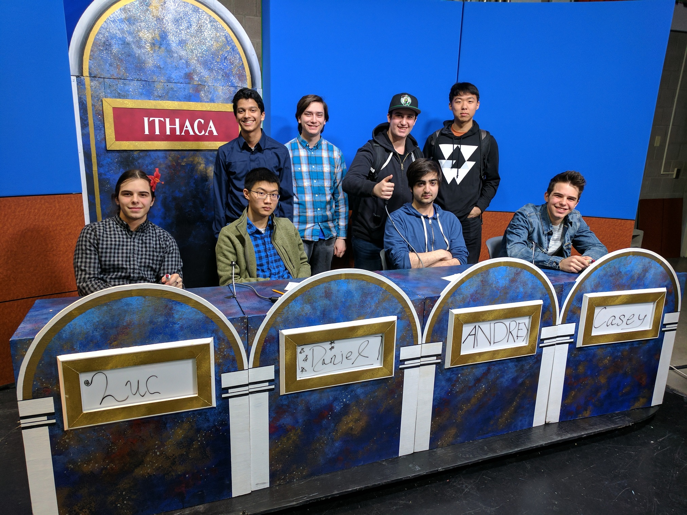

---
### Ithaca B     
**Coach**: Benjamin Kirk      
**Roster**:      
James Park (Senior, headed to California Institute of Technology)     
Isaiah Gutman (Sophomore)     
Vaynu Kadiyali (Sophomore)     
Justin Tan (Sophomore)
  

---
### Trinity     
**Coach**: Eric Casey      
**Roster**:      
Jake Fisher (Junior)     
Ignacio Lopez Gaffney (Junior)     
Will Kingham (Junior)     
Davis Lister  (Junior)
  

---
---

## Ohio

### Beavercreek High School     
**Coach**: Ellen Spence, Lakshmy Parameswaran      
**Roster**:      
Hari Parameswaran (Sophomore)     
David Cohen (Junior)     
Ziyi Zuo (Junior)     
Robert Reid (Senior, headed to University of Texas, Austin)
  

**Team Notes:**     
We're a very new quiz bowl program. In two years of competition, our team has grown a lot. We won our NAQT State Championship in April, and we also won the JV National History Bowl.

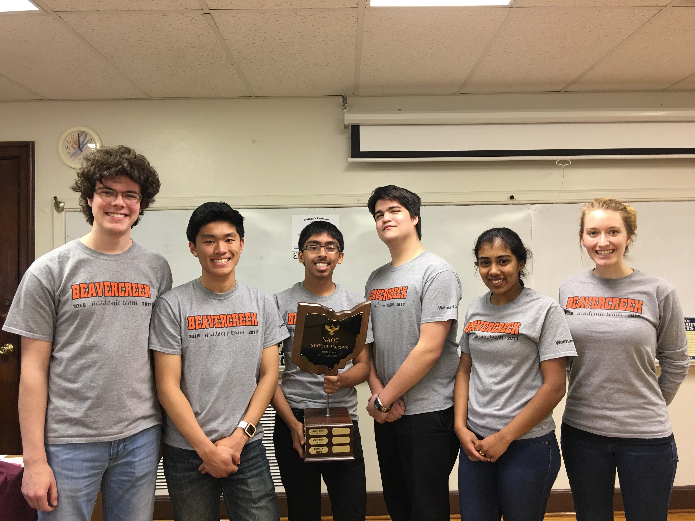

---
### Dublin Scioto High School     
**Coach**: Simon Birkhoff      
**Roster**:      
Eddy Liu (Freshman)     
Enoch Fu (Senior, headed to Ohio State)     
Sanjay Medicherla (Junior)     
Clark Smith (Junior)     
Gabriel Pinto (Sophomore) 

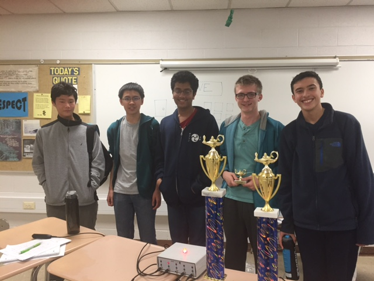

---
### Fisher Catholic      
**Coach**: Michael Sedlack, Lynn Stevenson      
**Roster**:      
Hunter Wotruba     Captain (Senior, headed to Miami University  Oxford, Ohio)     
Brock Conrad (Senior, headed to Ohio State University)     
Zach Vogel (Senior, headed to Ohio State University)     
Carter Corcoran (Senior, headed to University of Toledo)     
Alex Blackston (Junior) 

**Team Notes:**     
We are a small Catholic school of 161 students located in southeast Ohio.  We recently won took 2nd place at the OAC State Finals competing indirectly against 732 schools in Ohio many of them with an enrollment 2,000 or 3,000 students. Our students are involved in many aspects of life at Fisher including: quarterback on the football team, 1st single in tennis, lead in the school musical, valedictorian of the class. 

---
### Miami Valley (JV)     
**Coach**: Tyler Benedict      
**Roster**:      
John John Groger (Freshman)     
William Groger (Middle School)
 
 
  

---
### Northmont High School     
**Coach**: David Jones, Emily Bingham      
**Roster**:      
Kara Combs (Senior, headed to Wright State University)     
Ryan Laing (Junior)     
Caitlin Hoyng (Junior)     
Sean Scranton (Middle School)     
Athena Dobles (Freshman)     
Zach Weeks (Middle School)

**Team Notes:**     
The Northmont Academic Challenge team continued its string of successes this season by winning 4 tournaments and extending its conference winning streak to a record 151 games. Team captain Kara Combs was the top scorer at 5 tournaments this season and was a top 20 finisher at the National History Bee. The team competed at events all around the country this year, including Florida, North Carolina, Texas, Washington DC, and throughout the midwest. 

---
### Olentangy Liberty High School     
**Coach**: Cortney Bird      
**Roster**:      
Ini N'tukidem (Senior, headed to Ohio State University)     
Nayan Patel (Senior, headed to Ohio State University)     
Anna Pyo (Senior, headed to University of Cincinnati )     
Celia Zhang (Senior, headed to University of Pennsylvania)
  

**Team Notes:**     
This is the third year that our program has been actively traveling outside the the Metro Columbus area.  This past year we won the Harvest Prep Tournament, 2nd place at the Cavalier Classic, Waynedale and Waverly Invitationals.    

---
### Sidney High School (SS)     
**Coach**: Brett Bickel      
**Roster**:      
NourEddine Hijazi  (Senior, headed to Wright State University)     
Andrew Mitchell (Senior, headed to University of Cincinnati)     
Oliver Marchus (Sophomore)     
Whitney Petty (Freshman)
  

**Team Notes:**     
The Yellow Jacket Quiz bowl team finished another strong season, highlights include a 9th straight Shelby County title and 4th straight League (GWOC North) title, and 4th place at the NAQT Ohio state championship.  

---
---

## Oklahoma

### Norman High School     
**Coach**: David Powell, Alex Ruggiers      
**Roster**:      
Will Cohen (Senior, headed to Northwestern University)     
Jasper Johnston (Senior, headed to The University of Oklahoma)     
Jake Perry (Junior)     
Brian Thompson (Junior)     
Luke Fronheiser (Sophomore)     
Shengran Zhou (Freshman)

**Team Notes:**     
Our team is composed of seniors Jasper Johnston and Will Cohen, juniors Jake Perry and Brian Thompson, sophomore Luke Fronheiser, and freshman Shengran Zhou. (Augustus Kmetz, senior, was unable to attend.) Our **Coach**es are David Powell and Alex Ruggiers. This year the team competed in many NAQT-style tournaments, placing in all of them and going undefeated and winning the EMHS Bulldog Invitational in February and was the NAQT National Team of the Week. This team competed in the OSSAA State Academic Bowl tournament placing fourth. Gus Kmetz was selected for OACA All-State Academic Bowl honors and Will Cohen was selected for OACA Honorable Mention honors. This year’s seniors have played together for three years and have competed at the NAQT HSNCT in each of those years. We are excited to be participating in the PACE NSC this year and look forward to having a grand old time.

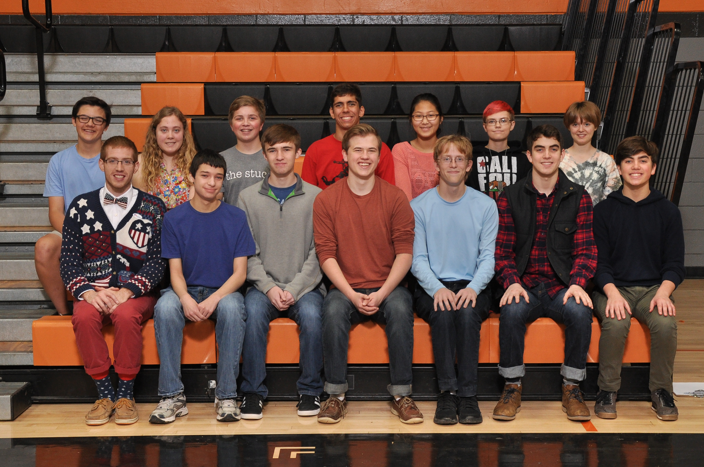

---
---

## Ontario, Canada

### Lisgar Collegiate Institute A     
**Coach**: Ruth Crabtree      
**Roster**:      
Sheena Li (Senior, headed to McGill University, Montreal)     
Colin Veevers (Junior)     
Gareth Adamson (Senior, headed to McGill University, Montreal)     
Josh Lane (Senior, headed to University of Toronto)
  

**Team Notes:**     
This will be Lisgar's second appearance at PACE, although we have attended HSNCT seven times. We were the first Canadian team to attend either tournament. Competition is relatively scarce in Canada so we have travelled to Ithaca's BrainBusters tournament for the last three years, finishing second last fall. Currently we are the Ottawa Regional QuizBowl champions. In the Canadian Reach for the Top competition format we are currently the regional champions, second in the province, and we will will be attending the National Finals in late May.

---
### Lisgar Collegiate Institute B     
**Coach**: Ruth Crabtree, Mark Meng      
**Roster**:      
William Von Herff (Senior, headed to McGill University, Montreal)     
Felipe Bemfica (Senior)     
Olive Nugent (Junior)     
Thomas Mennill (Sophomore)
  

**Team Notes:**     
This will be Lisgar Collegiate's second appearance at PACE. This year we qualified for PACE when we placed second in the Ottawa Regional Quiz Bowl.

---
---

## Pennsylvania

### Lehigh Valley Academy (SS)     
**Coach**: Charles Adami, Peter Schmidt, Leianne Whitley       
**Roster**:      
Lucas Larkin (Senior, headed to Rochester)     
Alex Schmidt (Junior)
 
 
  

**Team Notes:**     
2016-17: Champions of the Downingtown East, East Brunswick,  Great Valley, Henderson, and Manheim Township tournaments. Small School Champion at the National History Bowl.

---
---

## South Carolina

### Dorman      
**Coach**: Cyrenna Moreno, Brian Owen, Lee Holden      
**Roster**:      
Shub Mehta (Senior, headed to University of South Carolina)     
Lex Cooper (Senior, headed to Savannah College of Art and Design-Atlanta)     
William Richey (Junior)     
Chandler Parks (Junior)     
Sreya Pudi (Junior) 

---
### Southside High School A (SS)      
**Coach**: Brian Corbett       
**Roster**:      
Hasna Karim  (Senior, headed to Yale)     
Annabelle Yang (Senior, headed to Duke)     
Irene Williams  (Senior, headed to William & Mary)     
Ethan Magnuson (Senior, headed to University of South Carolina )
  

**Team Notes:**     
We won Harvard this year and some other stuff. Also, Ethan's beard is pretty decent this time around.

---
### Southside High School B (SS)     
**Coach**: Brian Corbett      
**Roster**:      
Melody Hong  (Senior, headed to Duke )     
Lijing Yao (Senior, headed to Carnegie Mellon)     
Cathy Chi  (Senior, headed to University of North Carolina)     
Dang Nguyen  (Senior, headed to Duke )     
Daniel Bacheschi (Senior, headed to Yale) 

**Team Notes:**     
We won Clemson.

---
---

## Singapore, Singapore

### Singapore American School     
**Coach**: Fred Crawford, Paul Welsh      
**Roster**:      
Katherine Enright (Junior)     
Arjun Joshi (Senior, headed to Washington University in St. Louis)     
Rohan Jasani (Sophomore)     
Tanvi Dutta Gupta (Junior)
  

**Team Notes:**     
The Singapore American School team is excited to be back at the PACE NSC for the fourth consecutive year. In the 2016-2017 school year, we placed first in Asian regional tournaments, both in Shanghai and in Singapore as well as other smaller tournaments like IHBB. We organised and/or participated in three official NAQT tournaments this year. Our team is made up of returning and new players and despite jet lag we are hoping to build upon last year's 16th place finish this time around.

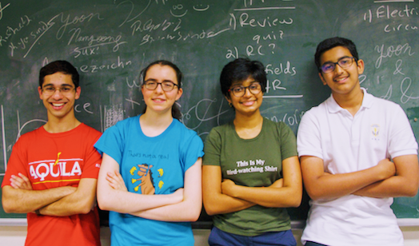

---
---

## Texas

### LASA      
**Coach**: Jason Flowers, Adam Escandell       
**Roster**:      
Ujwal Punyamurtula  (Senior, headed to Brown)     
Cass Plowman  (Senior, headed to Stanford )     
Nishanth Kalavakolanu  (Senior, headed to Air Force Academy )     
Graham Stockton  (Junior)
  

---
### St. John's School     
**Coach**: David Nathan      
**Roster**:      
Andy Huff (Senior, headed to University of Chicago)     
Aileen Zhang (Senior, headed to California Institute of Technology )     
Shomik Ghose (Sophomore)     
Raunak Kundagrami (Sophomore)
  

**Team Notes:**     
We won some, we lost some. Half of us are graduated, half are rising juniors. Full brains, fast buzz, can't lose. 

---
### St. Thomas High School     
**Coach**: Grover Green      
**Roster**:      
Adam Lawrence (Senior, headed to Rice University)     
Tyler McStravick (Sophomore)     
Nate Belcher (Junior)     
Kenny Dang (Junior)
  

**Team Notes:**     
The National WWII Quiz Bowl Champions

---
### Strake Jesuit (JV)      
**Coach**: Christopher Romero      
**Roster**:      
John Luke Broussard (Sophomore)     
Robert Condron (Freshman)     
Sean Doyle (Sophomore)     
Liam Garrison (Sophomore)     
Joshua Hew (Sophomore) 

---
---

## Virginia

### Maggie L. Walker Governor's School     
**Coach**: Hana Voight, Juanita Lasswell      
**Roster**:      
Parth Kotak (Senior, headed to George Washington University)     
Christian Moore (Senior, headed to College of William and Mary)     
Akshata Pisharody (Senior, headed to College of William and Mary)     
Catherine Qian (Junior)
  
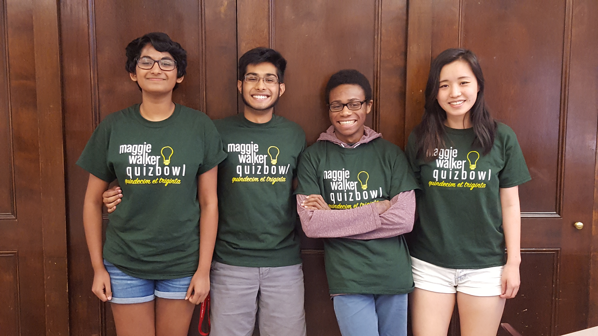

---
### TJHSST A     
**Coach**: John Laffey, Mildred Harris      
**Roster**:      
Rohan Hegde (Junior)     
Grant Li (Junior)     
Kevin Wang (Sophomore)     
Fred Zhang (Sophomore)
  

---
### TJHSST B     
**Coach**: John Laffey / Mildred Harris      
**Roster**:      
Ruyan Zhang (Senior, headed to University of Virginia)     
Alex Howe (Junior)     
Ben Xu (Sophomore)     
James Kuang (Sophomore)     
Andrew Wang (Junior) 

---
### TJHSST C     
**Coach**: Mildred Harris / John Laffey      
**Roster**:      
Julia Zhou (Sophomore)     
Nishanth Anand (Sophomore)     
Prithvi Nathan (Freshman)     
William Wang (Freshman)
  

